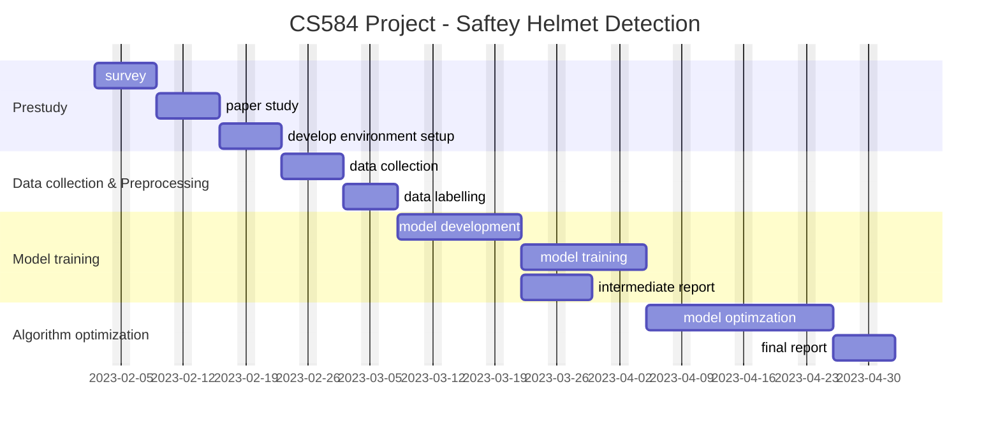

CS584 Project Proposal

# Project Title

Lightweight Safety Helmet Detection Using YOLO

# Team Members

- Gu Haijun
- Zhang Fuwei

# Problem Description

Safety helmet wearing plays a major role in protecting the safety of workers in industry and construction, so a real-time helmet wearing detection technology is very necessary. In this project, we are trying to use YOLO (v3 or v4) to achieve real-time and efficient safety helmet wearing detection. If possible, we also plan to explore methods as to improve the accuracy with lower cost. This might be including redesigning loss function, backbone network adjustment, etc.

# Brief Survey

Workplace safety has become a significant concern for many industries due to the effect of unsafe environments on productivity, and the resulting loss of workers. Manually monitoring violations of safety helmet regulations is not a feasible solution, especially at large construction sites. Therefore, automatic detection of safety helmet use is extremely important $^{[1]}$.

Automatic helmet detection is basically an object detection problem and can be solved using deep learning and computer vision-based approaches. Due to its computational method and precision in the field of object detection, deep learning and its applications in computer vision have achieved a breakthrough $^{[2]}$. The object identification method has been a research hotspot in the field of computer vision in recent years $^{[3]}$. Two types of state-of-the-art deep learning methods for object detection are currently available: the R-CNN (Convolutional Neural Network)-based target detection algorithm, which generates candidate regions first and then performs classification or regression $^{[4]}$, and the You Only Look Once $^{[5,6]}$ (YOLO) and Single Shot MultiBox Detector (SSD) algorithms $^{[7]}$], which perform classification or regression using only one CNN. R-CNN-based approaches achieved relatively higher accuracy with the demerit of longer execution time, making them unsuitable for real-time scenarios. The SSD algorithm runs faster but faces problems in detecting small objects, which could be problematic in automatic helmet detection $^{[8]}$. Therefore, YOLO, with its different architecture, was used in this study to detect safety helmets on construction sites automatically.

Today, applying YOLO on safety helmet detection becomes very common in real practice and one of the next challenges could be how to make it convenient and low cost from engineering perspective. In addition to creating a functional model, we will try to adopt new ideas $^{[9,10,11]}$ to create a lightweight yet efficient safety helmet detection model in this project.

# Preliminary Plan

# Reference
1. [Deep Learning-Based Automatic Safety Helmet Detection System for Construction Safety](!https://www.mdpi.com/2076-3417/12/16/8268)
2. [Automated vision-based recognition of construction worker actions for building interior construction operations using RGBD cameras](!https://scholar.google.com/scholar_lookup?title=Automated+vision-based+recognition+of+construction+worker+actions+for+building+interior+construction+operations+using+RGBD+cameras&conference=Proceedings+of+the+Construction+Research+Congress+2012:+Construction+Challenges+in+a+Flat+World&author=Escorcia,+V.&author=D%C3%A1vila,+M.A.&author=Golparvar-Fard,+M.&author=Niebles,+J.C.&publication_year=2012&doi=10.1061/9780784412329.089)
3. [A convolutional neural network based approach towards real-time hard hat detection](!https://scholar.google.com/scholar_lookup?title=A+convolutional+neural+network+based+approach+towards+real-time+hard+hat+detection&conference=Proceedings+of+the+2018+IEEE+International+Conference+on+Progress+in+Informatics+and+Computing&author=Xie,+Z.&author=Liu,+H.&author=Li,+Z.&author=He,+Y.&publication_year=2018&pages=430%E2%80%93434&doi=10.1109/pic.2018.8706269)
4. [Power of Deep Learning for Channel Estimation and Signal Detection in OFDM Systems](!https://scholar.google.com/scholar_lookup?title=Power+of+Deep+Learning+for+Channel+Estimation+and+Signal+Detection+in+OFDM+Systems&author=Ye,+H.&author=Li,+G.Y.&author=Juang,+B.-H.&publication_year=2017&journal=IEEE+Wirel.+Commun.+Lett.&volume=7&pages=114%E2%80%93117&doi=10.1109/LWC.2017.2757490)
5. [Gaussian YOLOv3: An Accurate and Fast Object Detector Using Localization Uncertainty for Autonomous Driving](!https://scholar.google.com/scholar_lookup?title=Gaussian+YOLOv3:+An+Accurate+and+Fast+Object+Detector+Using+Localization+Uncertainty+for+Autonomous+Driving&conference=Proceedings+of+the+2019+IEEE/CVF+International+Conference+on+Computer+Vision+(ICCV)&author=Choi,+J.&author=Chun,+D.&author=Kim,+H.&author=Lee,+H.-J.&publication_year=2019&pages=502%E2%80%93511)
6. [Compressing YOLO network by compressive sensing](!#) Proceedings on the 4th Asian Conference on Pattern Recognition, ACPR2017, Nanjing, China; pp. 19–24
7. [Top-Down Feature Fusion Single Shot MultiBox Detecto](!https://scholar.google.com/scholar_lookup?title=TDFSSD:+Top-Down+Feature+Fusion+Single+Shot+MultiBox+Detector&author=Pan,+H.&author=Jiang,+J.&author=Chen,+G.&publication_year=2020&journal=Signal+Process.+Image+Commun.&volume=89&pages=115987&doi=10.1016/j.image.2020.115987)
8. [Real-time personal protective equipment monitoring system](!https://scholar.google.com/scholar_lookup?title=Real-time+personal+protective+equipment+monitoring+system&author=Barro-Torres,+S.&author=Fern%C3%A1ndez-Caram%C3%A9s,+T.M.&author=P%C3%A9rez-Iglesias,+H.J.&author=Escudero,+C.J.&publication_year=2012&journal=Comput.+Commun.&volume=36&pages=42%E2%80%9350&doi=10.1016/j.comcom.2012.01.005)
9. [Application Research of Safety Helmet Detection Based on Low Computing Power Platform Using YOLO v5](!https://dl.acm.org/doi/abs/10.1007/978-3-031-06794-5_9)
10. [A Safety-Helmet Detection Algorithm Based on Attention Mechanism](!https://ieeexplore.ieee.org/document/9660439)
11. [Lightweight Helmet Detection Algorithm Using an Improved YOLOv4](!https://www.mdpi.com/1424-8220/23/3/1256)
